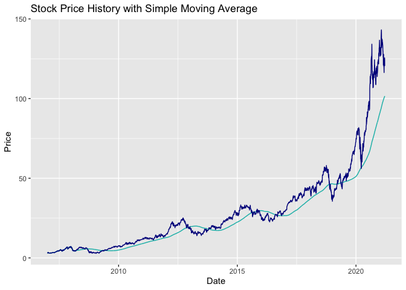

<!-- README.md is generated from README.Rmd. Please edit that file -->

# stockAnalyzer

<!-- badges: start -->

[](https://github.com/UBC-MDS/stockAnalyzer/actions)
[](https://github.com/UBC-MDS/stockAnalyzer/actions/workflows/test-coverage.yaml)
[](https://codecov.io/gh/UBC-MDS/stockAnalyzer)
<!-- badges: end -->

This is an R package that provides basic time series modelling
functionalities to analyze historical stock prices. Investment in the
stock market requires not only knowledge about the listed companies, but
also basic summary statistics and modellings of individual stock prices.
Given time-series stock price data, this package provides key summary
statistics, applies moving average and exponential smoothing models to
the data, and visualizes in-sample moving average as well as exponential
smoothing fits. A convenient use case for this package is to combine it
with the `quantmod` library, which can provide well-formated stock price
data.

## Installation

You can install the development version from
[GitHub](https://github.com/) with:

``` r
# install.packages("devtools")
devtools::install_github("UBC-MDS/stockAnalyzer")
```

## Features

The package contains the following five functions:

  - `summaryStats`

This function calculates summary statistics including mean price,
minimum price, maximum price, volatility and return rate based on daily
historical stock prices. Users can specify the stock they are interested
in and the exact measurement they prefer to analyze on.

  - `movingAverage`

This function applies the moving average model to all measurements of
stock price and returns an xts time series object containing in-sample
fitted values. Users can specify the length of moving average windows
(unit: days).

  - `exponentialSmoothing`

This function performs exponential smoothing on historical stock price
time series data. Users can specify the `alpha` parameter (which defines
the weighting, ranging between 0 and 1) for smoothing.

  - `visMovingAverage`

This function creates a line chart showing the raw historical data and
fitted data using the moving average method. Users are able to specify
the xts object used, the column of choice for moving average
calculation, and the length of moving average window (unit: days).

  - `visExpSmoothing`

This function creates a line chart showing the raw historical data and
fitted data using the exponential smoothing method. Users are able to
specify the xts object used, the column of choice for exponential
smoothing calculation, and the `alpha` parameter (which defines the
weighting, ranging between 0 and 1) for smoothing.

You can also find function descriptions and their use cases in [package
vignettes](https://ubc-mds.github.io/stockAnalyzer/reference/index.html).

## Documentation

  - [Vignettes Home
    Page](https://ubc-mds.github.io/stockAnalyzer/index.html)
  - [A Tour of Stock Analyzer
    Package](https://ubc-mds.github.io/stockAnalyzer/articles/stockAnalyzer-vignette.html)

## Example

This is a basic example which shows how to generate summary statistics,
conduct moving average modelling, exponential smoothing modeling, and
produce visualizations:

``` r
# Download stock price data
library(quantmod)
#> Loading required package: xts
#> Loading required package: zoo
#> 
#> Attaching package: 'zoo'
#> The following objects are masked from 'package:base':
#> 
#>     as.Date, as.Date.numeric
#> Loading required package: TTR
#> Registered S3 method overwritten by 'quantmod':
#>   method            from
#>   as.zoo.data.frame zoo
getSymbols("AAPL")
#> 'getSymbols' currently uses auto.assign=TRUE by default, but will
#> use auto.assign=FALSE in 0.5-0. You will still be able to use
#> 'loadSymbols' to automatically load data. getOption("getSymbols.env")
#> and getOption("getSymbols.auto.assign") will still be checked for
#> alternate defaults.
#> 
#> This message is shown once per session and may be disabled by setting 
#> options("getSymbols.warning4.0"=FALSE). See ?getSymbols for details.
#> [1] "AAPL"

library(stockAnalyzer)
summaryStats(AAPL)
#> # A tibble: 6 x 6
#>   measurement          mean         min         max  volatility return
#>   <chr>               <dbl>       <dbl>       <dbl>       <dbl>  <dbl>
#> 1 AAPL.Open            29.1        2.84        144.        27.5 38.9  
#> 2 AAPL.High            29.4        2.93        145.        27.8 38.8  
#> 3 AAPL.Low             28.8        2.79        141.        27.1 40.1  
#> 4 AAPL.Close           29.1        2.79        143.        27.5 39.3  
#> 5 AAPL.Volume   412534449.  45448000    3372969600  381472747.  -0.902
#> 6 AAPL.Adjusted        27.6        2.41        143.        27.7 45.8
head(movingAverage(AAPL, 300, paste("movingAverage", colnames(AAPL), sep="_")))
#>            movingAverage_AAPL.Open movingAverage_AAPL.High
#> 2007-01-03                3.081786                3.092143
#> 2007-01-04                3.001786                3.069643
#> 2007-01-05                3.063214                3.078571
#> 2007-01-08                3.070000                3.090357
#> 2007-01-09                3.087500                3.320714
#> 2007-01-10                3.383929                3.492857
#>            movingAverage_AAPL.Low movingAverage_AAPL.Close
#> 2007-01-03               2.925000                 2.992857
#> 2007-01-04               2.993571                 3.059286
#> 2007-01-05               3.014286                 3.037500
#> 2007-01-08               3.045714                 3.052500
#> 2007-01-09               3.041071                 3.306071
#> 2007-01-10               3.337500                 3.464286
#>            movingAverage_AAPL.Volume movingAverage_AAPL.Adjusted
#> 2007-01-03                1238319600                    2.577937
#> 2007-01-04                 847260400                    2.635158
#> 2007-01-05                 834741600                    2.616391
#> 2007-01-08                 797106800                    2.629312
#> 2007-01-09                3349298400                    2.847729
#> 2007-01-10                2952880000                    2.984010
head(exponentialSmoothing(AAPL,paste("expsmoothing", colnames(AAPL), sep="_"), 0.02))
#>            expsmoothing_AAPL.Open expsmoothing_AAPL.High expsmoothing_AAPL.Low
#> 2007-01-03               3.081786               3.092143              2.925000
#> 2007-01-04               3.080186               3.091693              2.926371
#> 2007-01-05               3.079847               3.091431              2.928130
#> 2007-01-08               3.079650               3.091409              2.930481
#> 2007-01-09               3.079807               3.095995              2.932693
#> 2007-01-10               3.085889               3.103932              2.940789
#>            expsmoothing_AAPL.Close expsmoothing_AAPL.Volume
#> 2007-01-03                2.992857               1238319600
#> 2007-01-04                2.994186               1230498416
#> 2007-01-05                2.995052               1222583280
#> 2007-01-08                2.996201               1214073750
#> 2007-01-09                3.002398               1256778243
#> 2007-01-10                3.011636               1290700278
#>            expsmoothing_AAPL.Adjusted
#> 2007-01-03                   2.577937
#> 2007-01-04                   2.579081
#> 2007-01-05                   2.579828
#> 2007-01-08                   2.580817
#> 2007-01-09                   2.586156
#> 2007-01-10                   2.594113
visMovingAverage(AAPL, 300, 'AAPL.Close')
```



``` r
visExpSmoothing(AAPL, 0.02, 'AAPL.Close')
```


## R Ecosystem

There are a number of libraries in the R ecosystem that provide
functionalities to analyze time series data. For example, `Tidyverse`
has comprehensive functionalities for basic summary statistics.
Libraries including `data.table`, `smooth` provide functions to
calculate moving average. Libraries including `smooth` and `forecast`
both provide functions to conduct exponential smoothing. `ggplot2` is
most widely used for visualizations.

In terms of financial data analysis, there are also a wide range of
packages. Widely used ones include
[`RQuantLib`](https://cran.r-project.org/web/packages/RQuantLib/index.html),
[`quantmod`](https://cran.r-project.org/web/packages/quantmod/index.html).
